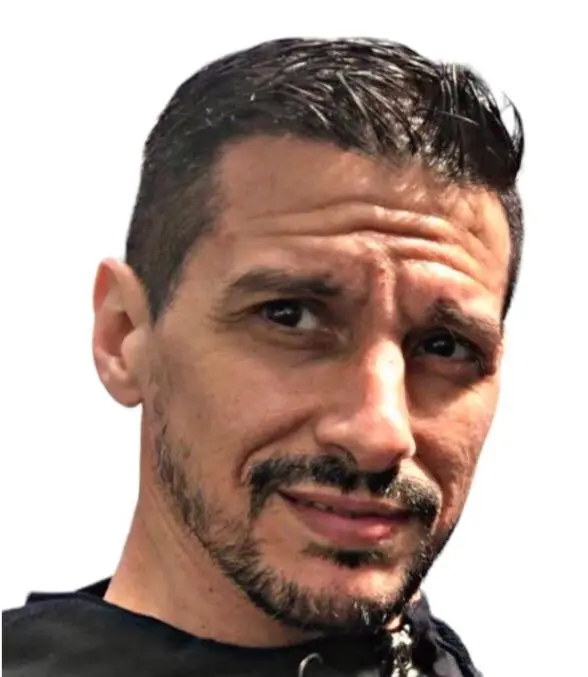

<h3>Mi nombre es Cristian Torchia, </h3>

- Técnico en Electrónica
- 45 Años
- Padre de 2 hijas
- Trabajo como líder de TI en una empresa metalúrgica
- Juego futbol
- Me gusta todo tipo de música pero prefiero el Rock

## Personal
<h4>Abandoné la carrera en 2008 para dedicarme full time a mi familia y al trabajo.</h4>
<h4>Hoy en día con mis hijas ya grandes (21 y 18) y el apoyo de mi pareja de toda la vida, decidí cumplir este sueño pendiente de tener un título universitario en la UTN.</h4>

## Laboral
<h4>Llevo casi 20 años trabajando en infraestructura y pude implementar muchas mejoras tecnológicas en la empresa.</h4>
<h4>Mis tareas actualmente están girando hacia los sistemas de información, por lo que deseo correrme un poco de la infraestructura para involucrarme de lleno a esa rama.</h4>

## Estudios
<h4>Realicé varios cursos relacionados a Desarrollo Web y me gustó mucho esa arista de la informática.</h4>
<h4>Mi objetivo es obtener bases sólidas de conocimiento para complementarlas con experiencia y poder en un futuro aspirar a un cargo gerencial.</h4>